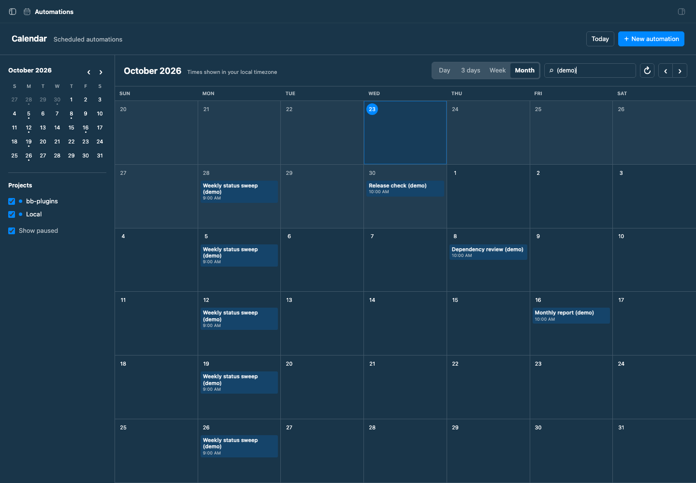
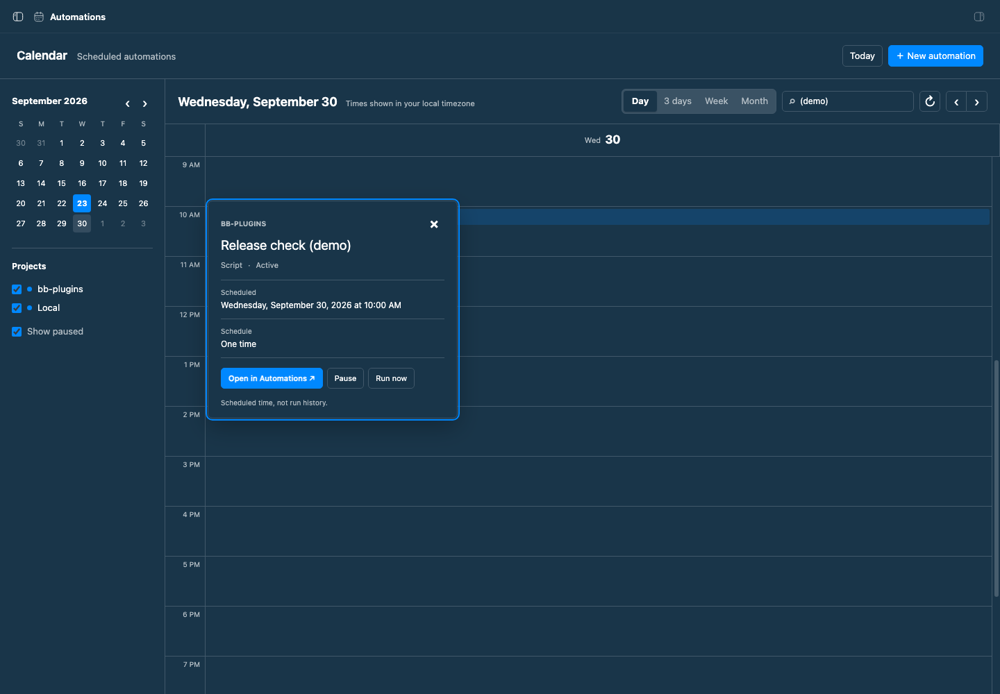
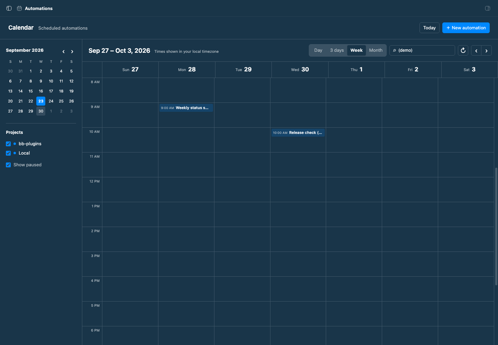

# Automation Calendar

Automation Calendar is a calendar view for BB's built-in Automations plugin. It reads the same automation records and uses the built-in scheduler. Install it alongside Automations to add an **Automations** calendar page to BB's sidebar.

Day, 3 days, Week, and Month views show one-time tasks and projected occurrences of recurring tasks. The current Month view starts with this week and shows six weeks, so upcoming dates remain visible at the turn of a month. Times appear in your local timezone. Paused automations appear muted, and project checkboxes and search narrow the view. Select an event to open a floating popup with pause, resume, run, and native Automations actions. Select a date in the month grid or mini calendar to open its day view.

Calendar entries are scheduled times, not run history. Open an automation in the built-in page to inspect its runs. Recurring schedules are projected from their saved cron expression and timezone, with a cap of 1,000 occurrences per automation in a 45-day window.

## Install

```sh
bb plugin install ./packages/bb-plugin-automation-calendar
```

The built-in Automations plugin must be enabled. Automation Calendar has no separate schedule storage and does not run jobs.

## Staged preview







The screenshots show BB's rendered month, day, and week views with safe staged automations. The capture also checks the three-day view and event popup.
