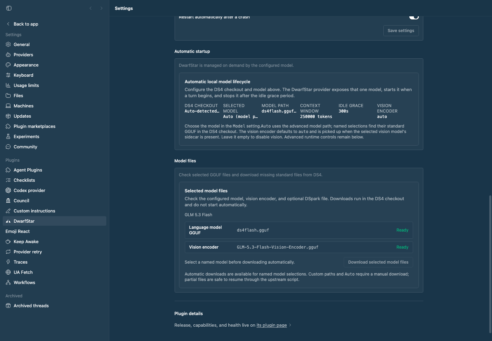

# bb-plugin-ds4 — DwarfStar

Configure a local **DwarfStar** (`antirez/ds4`, a.k.a. ds4.c) inference
server for BB. Once the setup is complete, choose **DwarfStar** as a provider
in BB's model picker. Its provider bridge keeps the first turn open while
`ds4-server` starts and waits for the configured GGUF before sending the
request, so the first message does not race server startup. Current DwarfStar
builds support DeepSeek V4 Flash, DeepSeek V4 Flash Vision Experimental,
DeepSeek V4 PRO, GLM 5.2, and GLM 5.3 Flash GGUFs. DeepSeek Vision Experimental
and GLM 5.3 Flash vision are supported when their encoder sidecars are available.

## Staged preview



Captured from the running BB application with the live DwarfStar configuration.

Requires a DS4 checkout with a built `ds4-server` binary and a downloaded
model (see the [ds4 README](https://github.com/antirez/ds4#readme)):

```sh
git clone https://github.com/antirez/ds4 ~/workingdir/ds4
cd ~/workingdir/ds4 && make
./download_model.sh ds4f-q2      # or another target for your hardware
./download_model.sh ds4f-dspark  # optional, for Flash DSpark acceleration
# For DeepSeek V4 Flash Vision Experimental:
./download_model.sh ds4f-vision-q2
./download_model.sh ds4f-vision-encoder
./download_model.sh ds4f-vision-dspark  # optional, matching DSpark support
# For GLM 5.3 Flash vision:
./download_model.sh glm53-q2
./download_model.sh glm53-vision
```

## Install

```sh
cd bb-plugin-ds4
bb plugin install .
bb plugin build      # optional: precompile the frontend
```

## What you get

- **First-class DwarfStar provider**: choose the `ds4` provider directly. The
  bridge owns the turn lifecycle, waits through model loading, streams text and
  reasoning deltas, forwards tool calls through BB, and supports image input
  for the selected vision model when its encoder is configured. It exposes
  exactly one model because DwarfStar loads one GGUF per process.
- **DwarfStar setup** (Settings → Plugins → DwarfStar): one configured
  checkout, model selection, vision encoder path, context window, and idle
  grace period. Advanced runtime tuning remains available below the core setup.
- **Model downloads**: the Settings → Plugins → DwarfStar page checks the
  selected language GGUF, vision encoder, and optional DSpark support file and
  shows whether each is ready, missing, partial, or a custom/manual path. For
  named model selections, **Download selected model files** runs the matching
  target from DS4's current `download_model.sh` in the configured checkout.
  Downloads are explicit and asynchronous; selecting a model never starts an
  81 GiB download by itself. `Auto` and custom paths remain manual.
- **Model selection**: choose `DeepSeek V4 Flash`, `DeepSeek V4 Flash Vision
  Experimental`, or `GLM 5.3 Flash` in the Model setting. `Auto` keeps the
  advanced `modelPath` behavior for custom GGUFs. A named selection resolves
  the matching standard GGUF in the DS4 checkout, so selecting it changes the
  model that DwarfStar loads.
- **Vision**: `visionPath=auto` finds the standard encoder for the selected
  vision model (`DeepSeek-V4-Flash-Vision-Encoder.gguf` or
  `GLM-5.3-Flash-Vision-Encoder.gguf`). Set an absolute or DS4-relative path to
  override it, or clear the setting to keep vision disabled.
- **Demand-driven supervision**: the local server starts when a first-class
  `ds4` provider turn begins or `bb ds4 start` is invoked. It stays warm through
  active native completions and stops after the configured idle grace period.
  Plugin-owned processes also stop as part of plugin reload/disable and BB
  shutdown.
- **Disconnect recovery**: if the BB host daemon disconnects after starting
  DwarfStar, the plugin records the managed PID and can reclaim that exact
  server on the next provider turn instead of starting a second copy. It also
  recognizes a compatible DS4 server already listening on the configured port,
  including one that is still loading its model. Unmarked existing servers are
  used but treated as external and are left running at idle; an explicit
  `bb ds4 stop` can terminate one. Its original endpoint is retained when
  settings change, so the explicit stop remains safe and effective.
- **Lifecycle feedback**: BB shows a host toast for lifecycle transitions and
  a host-framed status banner above the composer while DwarfStar is starting,
  stopping, or unavailable. It also confirms when the server becomes ready.
  During a first-class provider turn, the transcript also contains a separate
  `Starting DwarfStar` work item that updates while the GGUF loads and closes
  as `DwarfStar ready` (or shows the startup error). Startup feedback is
  especially useful because loading a large GGUF can take several minutes.
- **`bb ds4` diagnostics** (kept for troubleshooting):
  - `bb ds4 status` — state, pid, uptime, health, served models
  - `bb ds4 start | stop | restart`
  - `bb ds4 logs [-n N]` — recent process output (also persisted to
    `~/.bb/plugins/ds4/process.log`, rotated at 50 MB)
  - `bb ds4 agents [status|apply [pi|opencode|codex …]]`
  - `bb ds4 agent` — launch the interactive `ds4-agent` TUI in a BB terminal
  - `bb ds4 complete <prompt>` — one-shot completion against the local server
- **Harness tools for DwarfStar turns**: the `ds4` provider receives `read`,
  `edit`, and `bash`. `read` and `edit` use BB's host file API inside the
  current workspace; `bash` intentionally runs an unrestricted shell on the
  current host, starting in the workspace by default. These tools are supplied
  to DwarfStar turns; the legacy `ds4_status` and `ds4_complete` tools are not
  automatically injected into other providers.
- **Agent connections**: optionally write/merge provider configs so external
  agents can reach the server. This is explicit; use
  `bb ds4 agents apply <target>` when you want one:
  - Pi/BB → `~/.pi/agent/models.json` (provider `ds4`, selected DwarfStar model)
  - opencode → `~/.config/opencode/opencode.json` (provider `ds4`, agent `ds4`)
  - Codex CLI → `~/.codex/config.toml` (`[model_providers.ds4]`, Responses
    wire API)
  Existing files are merged (never clobbered) and a timestamped
  `.ds4bak-<ts>` copy is kept before each write.
  When vision is enabled, the generated DeepSeek Vision Experimental and GLM
  5.3 Pi and opencode models advertise both text and image input. DwarfStar's OpenAI Chat, Responses, and
  Anthropic endpoints accept inline PNG/JPEG image data; remote image URLs and
  file paths are not accepted.

## Supervision behavior

A background `supervisor` service:

- manages the server for native `bb ds4` operations, including process
  recovery, health polling, and idle shutdown,
- restarts after a crash while a native completion still needs it when
  **`restartOnCrash`** is on (exponential backoff
  2 s → 30 s, reset after a healthy run),
- restarts automatically when settings that affect the command line change
  (port, ctx, model, backend, …) for plugin-owned processes. An external
  process is left alone and reports an explicit `bb ds4 stop` instruction,
- polls `/v1/models` every 2 s and flips the status to **ready** (green) once
  the HTTP API answers, showing "loading model…" while a big GGUF is still
  being read,
- stops after `idleTimeoutSeconds` with no active native completion,
- stops the server cleanly (SIGTERM → SIGKILL after 12 s) on plugin
  reload/disable and BB shutdown,
- persists process metadata in `~/.bb/plugins/ds4/server.json` so an orphan can
  be verified by PID, executable, full command line, and start signature before
  it is reclaimed. Known external processes are recorded too, but remain
  `ownership: external` and are not stopped by idle supervision.
- keeps a recovered server in the loading state through transient health
  failures while its process identity is still valid, then retries/restarts
  only after the recovery grace period expires.

First-class `ds4` provider turns keep the turn open while the bridge starts or
waits for `ds4-server`; the completion request is sent only after `/v1/models`
contains the configured DwarfStar model. BB surfaces the loading window with a
host toast, composer banner, and separate transcript work item. External-agent
configs are generated only by an explicit `bb ds4 agents apply` command.

## Settings (`bb plugin config ds4`)

The first five settings are the normal setup. The remaining settings are
advanced runtime and compatibility controls.

| Key | Default | Meaning |
| --- | --- | --- |
| `ds4Dir` | `""` | DS4 checkout dir. Empty = auto-detect (`DS4_DIR`, `~/workingdir/ds4`, `~/ds4`, …) |
| `modelPreset` | `auto` | Single model to load: `auto`, `DeepSeek V4 Flash`, `DeepSeek V4 Flash Vision Experimental`, or `GLM 5.3 Flash` |
| `modelPath` | `""` | Advanced GGUF path override; absolute or relative to `ds4Dir`, used when `modelPreset=auto`. Empty = `ds4flash.gguf` |
| `visionPath` | `auto` | Selected-model vision encoder path; auto-detects the standard sidecar, absolute/DS4-relative paths override it, and empty disables vision |
| `ctx` | `250000` | Context tokens (`-c`); tuned for the 2-bit model on a 128 GB Apple Silicon host |
| `idleTimeoutSeconds` | `300` | How long to keep the server warm after the last matching turn |
| `backend` | `auto` | `metal` \| `cuda` \| `rocm` \| `cpu` |
| `host` | `127.0.0.1` | Bind address |
| `port` | `8000` | Bind port |
| `maxTokens` | `384000` | Default maximum output tokens (`-n`) |
| `kvDiskDir` | `/tmp/ds4-kv` | Disk KV cache dir; empty disables it |
| `kvDiskSpaceMb` | `8192` | KV cache disk budget |
| `power` | `""` | GPU duty cycle (`--power 1..100`) |
| `extraArgs` | `""` | Extra flags appended to the command line |
| `dspark` | `false` | Enable the Flash-only DSpark optimization; requires the matching 0731 support GGUF |
| `dsparkSupportPath` | `""` | Absolute or DS4-relative support GGUF path; empty auto-detects the matching standard support GGUF |
| `dsparkConfidence` | `""` | DSpark threshold (`0..1`); empty uses DwarfStar's backend default (Metal `0.6`, CUDA/ROCm `0.7`) |
| `restartOnCrash` | `true` | Restart after a crash (backoff) |

## Notes

- Provider-bridge turns forward BB-injected dynamic tools over the bridge's
  runtime tool-call channel. This plugin supplies read/edit and unrestricted
  host bash; web search/fetch tools are not invented here and appear when BB or
  another enabled plugin injects them for the session.
- The plugin manages **`ds4-server`** (the OpenAI/Anthropic/Responses HTTP
  server). The interactive **`ds4-agent`** TUI is launched into a BB terminal
  (`bb ds4 agent`) where you drive it directly — sessions save under
  `~/.ds4/kvcache` via `/save`.
- DSpark is opt-in for `ds4-server` and `ds4-agent`, using
  `--mtp-model <support.gguf> --dspark`. For the current Flash checkpoint, download
  it with `./download_model.sh ds4f-dspark`; for Vision Experimental use
  `./download_model.sh ds4f-vision-dspark`. The plugin refuses to start while
  the configured support file is missing or mismatched, so it cannot silently
  run an incompatible DSpark combination. Leave `dspark=false` for GLM 5.2,
  DeepSeek V4 PRO, or a baseline run. Older checkouts using the pre-0731
  support filename are still detected as a compatibility fallback.
- DeepSeek V4 Flash Vision Experimental and GLM 5.3 Flash vision use separate
  encoder GGUFs. The plugin passes `--vision <encoder.gguf>` to both
  `ds4-server` and `ds4-agent`; the latter exposes the native `view_image` tool.
  The native `ds4_complete` input accepts
  up to 16 inline PNG/JPEG data-URI images, capped at 16 MiB per image and
  32 MiB combined by the plugin, with prompt and system text capped at 8 MiB
  and all completion content capped at 40 MiB. Serialized completion request
  bodies are capped at 60 MiB, below the upstream 64 MiB HTTP limit. Download
  the sidecar with
  `./download_model.sh glm53-vision` or `./download_model.sh ds4f-vision-encoder`;
  `visionPath=auto` then enables it for the matching vision model in the same
  checkout. Run `bb ds4 agents apply <target>` only
  when you explicitly want to refresh an external agent config.
- The native `ds4_complete` tool also accepts an optional `imageUrls` array of
  inline PNG/JPEG data URIs when the encoder is configured.
- Vision startup requires a recognizable DeepSeek Vision Experimental or GLM
  5.3 model path (a symlink may carry the recognizable name) and a GPU backend;
  CPU vision is rejected.
  While vision is enabled, model/backend/vision overrides are rejected in
  `extraArgs`, and `--chdir` is rejected so process recovery remains cwd-safe.
  Vision also rejects explicit multi-GPU placement flags because the current
  upstream GLM 5.3 path does not support multi-GPU vision startup.
- The plugin runs on the machine that runs the BB server (full-trust plugin
  code); it spawns the process locally and writes agent configs on the same
  host.
- Start is refused with an actionable error when the model file is missing
  (e.g. while `download_model.sh` is still running).
- The Settings → Plugins → DwarfStar **Model files** section checks the exact
  resolved paths before startup. Its download button invokes only fixed
  upstream targets (`ds4f-q2`, `ds4f-vision-q2`, `ds4f-vision-dspark`,
  `glm53-q2`, or `glm53-vision`) and reports failures without hiding partial
  downloads. If `DS4_GGUF_DIR` is set, the plugin follows the downloader's
  configured output directory for both status checks and startup resolution.
