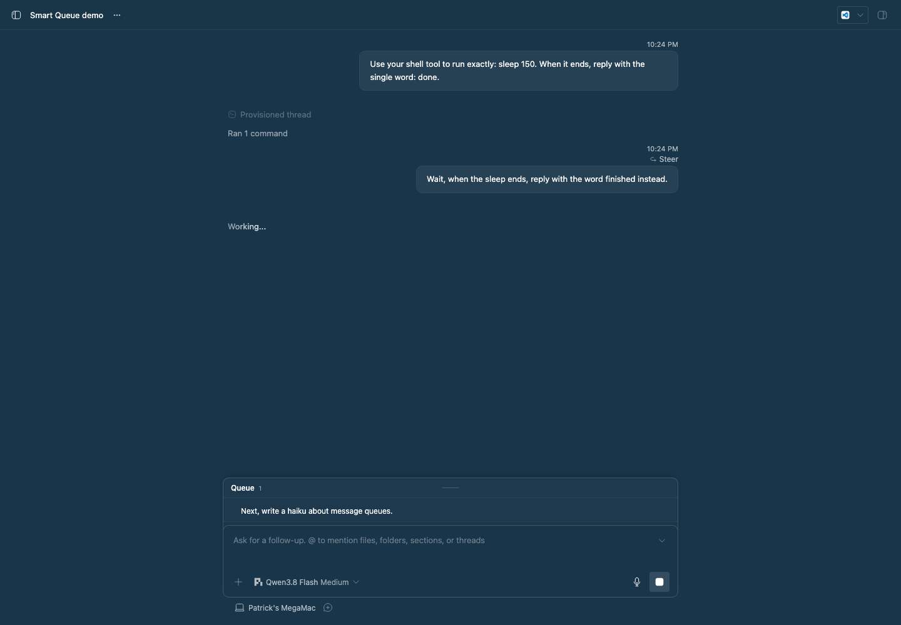

# Smart Queue

Smart Queue decides what happens when you send a message to a thread that is
still working. A correction or urgent change **steers** the running turn now.
A separate or later task waits as a **follow-up** until the turn ends. You no
longer need to pick steer or queue yourself.

Bot Teams makes the same choice for busy bots in channels. Smart Queue does it
for ordinary threads.

## How it decides

1. **Jev** answers first. Smart Queue sends Jev the thread title, your recent
   requests, the latest assistant output, and the new message. Jev returns
   `steer` or `followup` with a confidence. A steer below the confidence
   threshold (default 0.7) becomes a follow-up.
2. **The fallback model** answers when Jev is unavailable: no OpenCode Zen API
   key, an HTTP error, a timeout, or an invalid answer. It runs the same
   question in a hidden, temporary thread in BB's Personal project, on the
   thread's machine, and deletes it afterwards. The default is
   `pi` / `opencode-go/qwen3.8-flash`.
3. **Follow-up** is used when neither answers. An unnecessary steer interrupts
   work, so waiting is the safe default.

All conversation text is sent as data, with instructions to treat it as data.

## What it handles

Smart Queue acts only on messages you send yourself to a busy thread. It
ignores messages from agents and other threads, plugin submissions, retries,
scheduled messages, hidden threads, and Bot Teams threads (Bot Teams routes
those itself).

Both composer settings work:

- **Enter steers a busy thread.** Smart Queue holds the message. The queued
  card shows *Smart Queue is deciding whether to steer or follow up*, then
  either the message joins the turn or the card changes to *Smart Queue:
  follow-up after the current turn*. The row is released when the thread goes
  idle.
- **Enter queues.** The app adds the message to the thread's queue directly.
  Smart Queue checks the queue every second, classifies the new row, and sends
  it into the turn if it should steer. A follow-up stays in the queue as BB
  normally would. This row shows no Smart Queue reason, because core owns its
  wait.

When several messages steer, they reach the turn in the order you sent them.
The queued card's own **Send now** and **Steer** buttons still override Smart
Queue.

## Settings

Open **Settings → Plugins → Smart Queue**, or use `bb plugin config smart-queue`.

| Setting | Default | Purpose |
| --- | --- | --- |
| `enabled` | `true` | Turn classification on or off. |
| `zenApiKey` | — | OpenCode Zen key for Jev (secret). Falls back to the server's `OPENCODE_API_KEY`. |
| `jevModel` | `jev-1.13` | Jev model. |
| `jevTimeoutMs` | `5000` | Jev request deadline, 250 to 15000 ms. |
| `steerConfidence` | `0.7` | Minimum Jev confidence to steer. |
| `fallbackProvider` | `pi` | Provider for the fallback model. Leave empty to skip it. |
| `fallbackModel` | `opencode-go/qwen3.8-flash` | Fallback model ID from your provider catalog. |

## Commands

```sh
bb smart-queue status              # Which classifiers are available
bb smart-queue recent [--limit n]  # Recent decisions, newest first
bb smart-queue classify <thread-id> <message>  # Dry run; sends nothing
```

Every command accepts `--json`.

## Staged preview



This screenshot is captured from BB's rendered thread UI. A seeded thread is
busy running `sleep 150` in its shell. Two messages were typed into the real
composer while it worked. Smart Queue steered the correction ("Wait, when the
sleep ends, reply with the word finished instead.") into the running turn,
shown by BB's **Steer** label. It kept the separate task ("Next, write a haiku
about message queues.") in the **Queue** as a follow-up. The capture also checks
both decisions in `bb smart-queue recent`.

## Install

```sh
bb plugin install ./packages/bb-plugin-smart-queue --yes
```

## Development

```sh
pnpm --dir packages/bb-plugin-smart-queue test
pnpm --dir packages/bb-plugin-smart-queue typecheck
pnpm --dir packages/bb-plugin-smart-queue build
```
