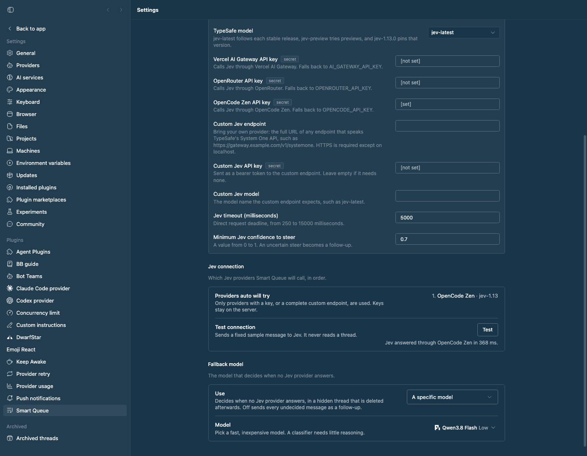

# Smart Queue

Smart Queue decides what happens when you send a message to a thread that is
still working. A correction or urgent change **steers** the running turn now.
A separate or later task waits as a **follow-up** until the turn ends. You no
longer need to pick steer or queue yourself.

Bot Teams makes the same choice for busy bots in channels. Smart Queue does it
for ordinary threads.

## How it decides

1. **Jev** answers first. Smart Queue sends Jev the thread title, your last
   three requests, the last 2,000 characters of assistant output, and the new
   message. Jev returns `steer` or `followup` with a confidence. A steer below
   the confidence threshold (default 0.7) becomes a follow-up.
2. **The fallback model** answers when no Jev provider does. It asks the same
   question in a hidden, temporary thread in BB's Personal project, on the
   thread's machine, and deletes the thread afterwards. By default it uses the
   thread's own provider and that provider's default model. Pick a fast,
   inexpensive model with BB's model picker in settings, or turn it off.
3. **Follow-up** is used when neither answers. An unnecessary steer interrupts
   work, so waiting is the safe default.

All conversation text is sent as data, with instructions to treat it as data.

## Jev providers

Every provider serves the same Jev model through TypeSafe's
[System One API](https://docs.typesafe.ai/api). Add a key for any of them.

| Provider | Key setting | Environment fallback | Model |
| --- | --- | --- | --- |
| [TypeSafe](https://typesafe.ai) (canonical) | `typesafeApiKey` | `TYPESAFE_API_KEY` | `typesafeModel`, default `jev-latest` |
| Vercel AI Gateway | `vercelApiKey` | `AI_GATEWAY_API_KEY` | `typesafe-ai/jev` |
| OpenRouter | `openRouterApiKey` | `OPENROUTER_API_KEY` | `typesafe/jev-1.13` |
| OpenCode Zen | `zenApiKey` | `OPENCODE_API_KEY` | `jev-1.13` |
| Custom | `customJevApiKey` (optional) | — | `customJevModel` |

`jevProvider` chooses where to call Jev. `auto`, the default, tries the
providers in the order above, uses each one that has a key, and moves to the
next when one fails. Name one provider to use only that one.

**Bring your own provider.** Set `customJevEndpoint` to the full URL of any
endpoint that accepts System One requests, such as a company gateway or a
self-hosted proxy, and set `customJevModel` to the model name it expects. The
custom key is sent as a bearer token when set. The endpoint must use HTTPS,
except on `localhost`.

Each provider bills its own usage. TypeSafe charges per input token. A
Smart Queue decision sends at most about 25,000 characters, and usually far
less.

## What it handles

Smart Queue acts only on messages you send yourself to a busy thread. It
ignores messages from agents and other threads, plugin submissions, retries,
scheduled messages, hidden threads, and Bot Teams threads (Bot Teams routes
those itself).

Both composer settings work:

- **Enter steers a busy thread.** Smart Queue holds the message. The queued
  card shows *Smart Queue is deciding whether to steer or follow up*, then
  either the message joins the turn or the card changes to *Smart Queue:
  follow-up after the current turn*. The row is released when the thread goes
  idle.
- **Enter queues.** The app adds the message to the thread's queue directly.
  Smart Queue checks the queue every second, classifies the new row, and sends
  it into the turn if it should steer. A follow-up stays in the queue as BB
  normally would. This row shows no Smart Queue reason, because core owns its
  wait.

When several messages steer, they reach the turn in the order you sent them.
The queued card's own **Send now** and **Steer** buttons still override Smart
Queue.

## Settings

Open **Settings → Plugins → Smart Queue**, or use `bb plugin config smart-queue`.

| Setting | Default | Purpose |
| --- | --- | --- |
| `enabled` | `true` | Turn classification on or off. |
| `jevProvider` | `auto` | `auto`, `typesafe`, `vercel`, `openrouter`, `opencode-zen`, or `custom`. |
| `typesafeApiKey`, `vercelApiKey`, `openRouterApiKey`, `zenApiKey` | — | Provider keys (secret). See [Jev providers](#jev-providers). |
| `typesafeModel` | `jev-latest` | Dropdown: `jev-latest`, `jev-preview`, or `jev-1.13.0` to pin that version. |
| `customJevEndpoint`, `customJevApiKey`, `customJevModel` | — | Your own System One endpoint. |
| `jevTimeoutMs` | `5000` | Deadline for each provider attempt, 250 to 15000 ms. |
| `steerConfidence` | `0.7` | Minimum Jev confidence to steer. |

Below the form, two sections complete the page:

- **Jev connection** lists the providers Smart Queue will call, in order, and
  any configuration problems. **Test** sends a fixed sample message to Jev and
  reports which provider answered; it never reads a thread.
- **Fallback model** chooses what decides when no Jev provider answers: the
  thread's provider, a specific model picked with BB's own provider, model,
  and reasoning picker, or off. The same choice is available as
  `bb smart-queue fallback`.

## Commands

```sh
bb smart-queue status              # Jev routes, problems, and the fallback model
bb smart-queue recent [--limit n]  # Recent decisions, newest first
bb smart-queue classify <thread-id> <message>  # Dry run; sends nothing
bb smart-queue check               # Test the Jev connection with a sample message
bb smart-queue fallback [thread | off | <provider-id> <model> [<reasoning>]]
```

Every command accepts `--json`.

## Staged preview


This screenshot is captured from BB's rendered thread UI. A seeded thread is
busy running `sleep 150` in its shell. Two messages were typed into the real
composer while it worked. Smart Queue steered the correction ("Stop, cancel
the sleep now and reply with the word cancelled.") into the running turn,
shown by BB's **Steer** label. It kept the separate task ("Next, write a haiku
about message queues.") in the **Queue** as a follow-up. The capture also checks
both decisions in `bb smart-queue recent`.



The second screenshot is the plugin's real settings page. It shows the
TypeSafe model dropdown, a key field for each Jev provider, and the custom
endpoint fields. Below them, **Jev connection** lists OpenCode Zen, the only
provider with a key (shown masked), and a live **Test** result. **Fallback
model** shows pi's Qwen3.8 Flash at low reasoning, chosen in BB's model
picker.

## Install

```sh
bb plugin install ./packages/bb-plugin-smart-queue --yes
```

## Development

```sh
pnpm --dir packages/bb-plugin-smart-queue test
pnpm --dir packages/bb-plugin-smart-queue typecheck
pnpm --dir packages/bb-plugin-smart-queue build
```
