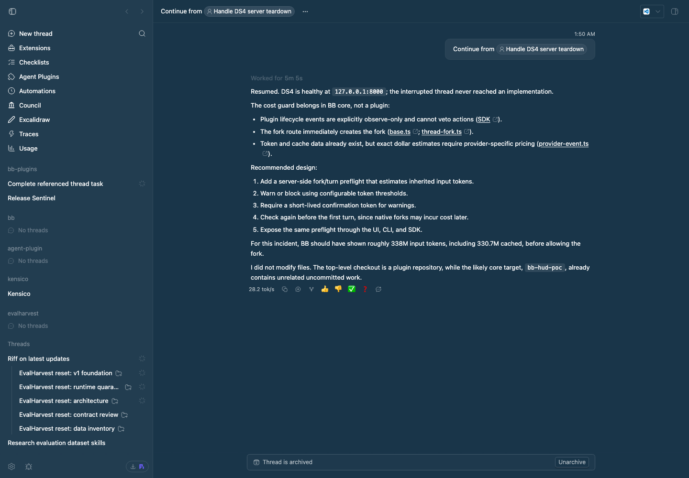

# Tok Speed

Tok Speed displays a small `tok/s` label in each assistant message's hover
action row. The number is provider generation throughput for that turn: total
output tokens divided by the sum of active provider-item time. It deliberately
excludes time spent running commands, fetching tool results, or otherwise
waiting on the host, so it answers “how fast was the provider generating?”

The plugin reads BB's provider item lifecycle events and
`thread/tokenUsage/updated`. Providers that do not report usable output usage
or completed provider item timings simply have no label. The label's tooltip
includes the output tokens and provider usage samples included in the pooled
rate.

## Staged preview



This screenshot is captured from BB's rendered thread UI with seeded local
conversation data, a hovered assistant message, and a live `tok/s` decoration
in the bottom action row.

## Install

```sh
bb plugin install ./packages/bb-plugin-tok-speed --yes
```

## Development

```sh
pnpm --dir packages/bb-plugin-tok-speed test
pnpm --dir packages/bb-plugin-tok-speed typecheck
pnpm --dir packages/bb-plugin-tok-speed build
```
