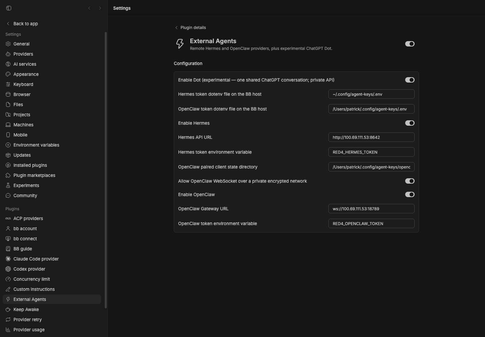

# External Agents

Hermes HTTP, OpenClaw ACP, and experimental ChatGPT Dot providers for stable
BB 0.45.0 and Plugin SDK 0.6.15. Hermes and OpenClaw have both returned `ok`
in staged BB against red4 after native sign-in.

The provider process runs on the selected BB host and connects to a remote
agent server. The provider IDs are `hermes`, `openclaw`, and `dot`.

## Development

```sh
npm install --include=dev
npm run typecheck
npm test
```

The Hermes client implements `/v1/models`, `/v1/runs`, run event streaming,
and the run `/approval`, `/steer`, and `/stop` endpoints. Tests derive their
wire shapes from Hermes's `gateway/platforms/api_server_runs.py`.

Credentials come from a supplied secret or a named environment variable.
HTTP errors omit response bodies and underlying network error details to
keep credentials out of diagnostics. Redirects are refused.

Hermes tool events carry names without call IDs. The mapper assigns IDs and
matches completions in order for each tool name. Approval responses retain
the exact Hermes request ID and never broaden the choices the server offers.

## Dot settings

Set `dotEnabled=true` to register provider/model `dot`. It is experimental and
disabled by default. Run it on this Mac with an existing ChatGPT sign-in in
`~/.codex/auth.json` and the `codex` CLI available for authentication refresh.
No token setting or credential copying is needed. The health RPC accepts
`{provider:"dot"}` and reports `paused` when Dot is paused in ChatGPT.

Use one Studio bot for Dot: every BB thread shares the same persistent room.
Tools execute in Dot’s cloud environment; local BB tools are not injected.
See the [transport notes](docs/dot-transport.md) for the private routes.

## Settings and health

Hermes uses `hermesEnabled`, `hermesBaseUrl`, and `hermesTokenEnv`.
The token variable defaults to `RED4_HERMES_TOKEN` on the selected BB host.
The provider is disabled by default until its endpoint is configured.

The plugin RPC `health` accepts `{ hostId?, provider: "hermes" }` and returns
`{ online, status, message }`. It runs the authenticated model probe on that
host. If `hostId` is omitted, it uses BB's local server host. Disabled providers
return `status: "disabled"` without a network probe. The office UI can use
`online: false` for its Offline state.

The fixture integration test covers session start/resume, run creation,
BB approval response routing, steering, and remote stop. The red4 live prompt checks also pass.

OpenClaw uses `openclawEnabled`, `openclawBaseUrl` (a `ws://` or `wss://`
Gateway URL), and `openclawTokenEnv` (default `RED4_OPENCLAW_TOKEN`). Install
`openclaw` on the BB host. `openclawStateDir` selects its paired client state;
`openclawAllowPrivateWs` permits the encrypted Tailscale route when enabled.
The same health RPC accepts `provider: "openclaw"`.

Gateway agents appear as `openclaw/<agentId>` models. Each BB thread gets a
stable, isolated Gateway session key under that agent. Credentials are written
to private temporary files and never put in ACP process arguments. Files are
removed when the bridge closes. No permanent OpenClaw configuration is edited.

The paired Gateway client needs `operator.read` for model discovery, plus its
normal ACP permissions. Gateway reachability does not prove that an upstream
model provider is authenticated. The turn can still fail with a provider error.

Optional live catalog test (load the token variables into the shell first):

```sh
BB_EXTERNAL_LIVE=1 npm test
```

Live red4 checks now pass for both agents. OpenClaw’s ACP wire guard converts
empty completions and explicit upstream errors into failed BB turns. Run its
process with access to the existing paired state and OpenClaw cache directory;
sandbox-denied identity loading can appear as a misleading scope rejection.
No Gateway scope upgrade was needed.

## Staged preview



Captured from the full BB 0.45.0 application with the experimental Dot setting,
the red4 Tailscale URLs, token variable names, and paired OpenClaw client
state configured. The screenshot contains paths and variable names, not
credential values.

If the BB host does not inherit the token variable, set `hermesTokenEnvFile`
or `openclawTokenEnvFile` to a dotenv file on that host. Only the named
assignment is used. The parser does not execute shell code or expand values;
the process environment takes precedence.

Both agents run tools remotely. OpenClaw rejects per-session MCP servers,
so its bridge does not pass BB's dynamic tool server to the Gateway. Configure
additional tools on the remote agent itself.

Staged evidence: the plugin installs from Git on stable BB 0.45.0. A real
Hermes BB thread reaches red4 and records the remote missing-credentials
error as a failed turn. After native sign-in, both staged providers returned
exact `ok`. OpenClaw’s live catalog and authenticated health checks also pass.

Hermes also passes the published BB provider-bridge conformance suite using
an HTTP fixture. OpenClaw routing tests cover cancellation during preflight
and rejection of a model change that would otherwise keep using the old
Gateway agent. Start a new BB thread to select another OpenClaw agent.

The deterministic `scripts/hermes-fixture.mjs` also passed an approval round-trip
through the full staged BB 0.45.0 runtime: a pending interaction appeared,
Allow once reached the exact Hermes request ID, and the thread completed with
`ok`. This fixture executes no commands. This verifies BB approval integration independently of model credentials.

## Experimental Dot: best-effort correlation

Dot is disabled by default. Its private ChatGPT routes may break.
All BB Dot threads will share one persistent agent and one conversation.

Prefer an exact `request_id` or `reply_to` match. When neither is echoed, the
approved fallback requires one BB request in flight per Dot across provider
processes. Accept a candidate reply only from the Dot's verified member ID,
created after the submitted message's **server timestamp**, and received before
the matching cloud WebSocket turn completes. Use the `turn/started` →
`turn/completed` pair after submission as the correlation window.

This is best-effort correlation, not proof of causality. If another client sends
a message during that window, mark the BB turn uncertain and display the candidate
reply with a note explaining that it may respond to the other client's message.
Do not silently discard it or label it confidently as the BB request's answer.
The bridge implements this fallback and displays the uncertainty note. It uses
cloud WebSocket turn/tool events and interrupts only the tracked active turn.
A reconnect rereads auth and room/root state; a stream gap marks correlation
uncertain. The shared room queue spans provider processes on this Mac.

If a submitted request loses its confirmed outcome, the queue remains locked
in `~/.config/bb-external-agents/dot-queue/` to prevent overlapping submissions.
Check the Dot in ChatGPT before recovering that room’s lock. Do not enable
the same Dot on multiple BB hosts: their local queues are not coordinated.


Dot staged evidence: the exact random test token arrived in the BB timeline,
including Dot’s reply tool event. A separate BB Stop test left the cloud turn
`interrupted` and the Dot root `idle`, verified by a read-only WebSocket resume.
Initial history reads exposed the private API’s 32-message limit and nullable
text fields; both are handled. Fixture tests cover exact/fallback correlation,
queueing, interruption, reconnect setup, token refresh, and error handling.
